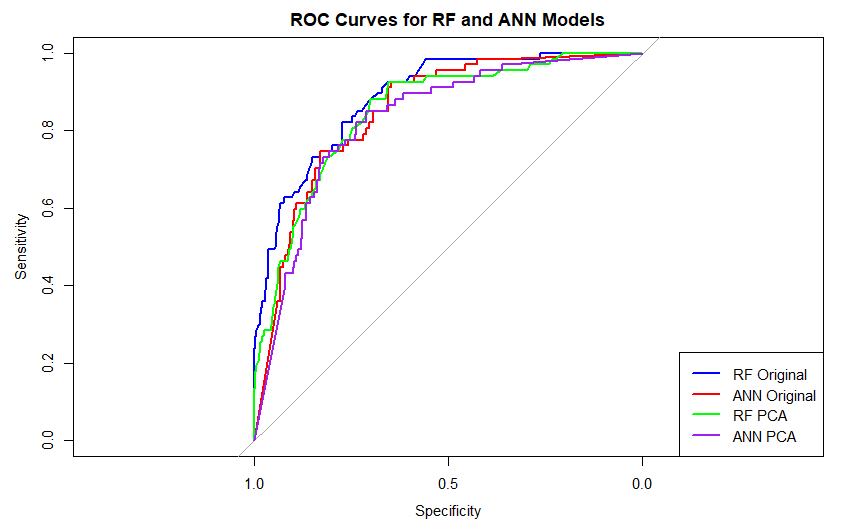
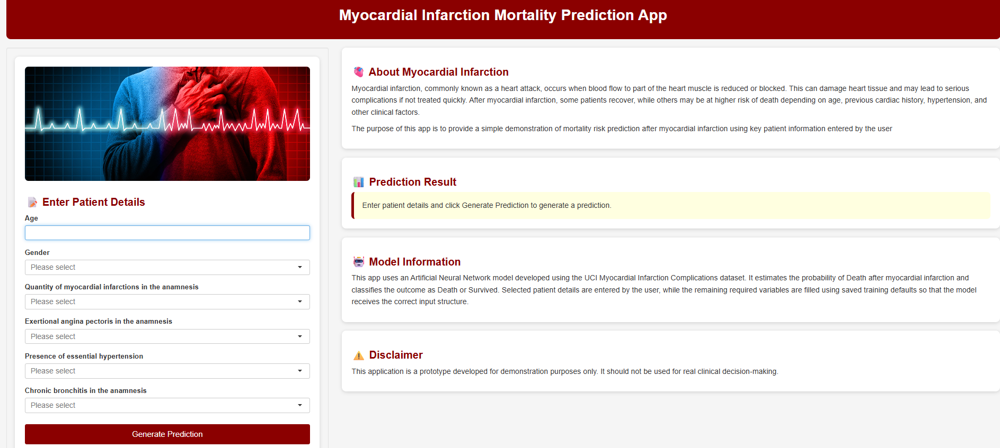

# 🫀 Myocardial Infarction Mortality Prediction

### Random Forest vs Artificial Neural Network | R | Healthcare ML | Shiny Deployment

---

## 🔗 Live Application

👉 [Open the MI Mortality Prediction Shiny App](https://poojabisht.shinyapps.io/mi-mortality-prediction/)

---

## 📌 Overview

This project compares **Random Forest (RF)** and **Artificial Neural Network (ANN)** models for predicting mortality outcomes after **myocardial infarction (MI)**.

The analysis uses the **UCI Myocardial Infarction Complications dataset** and frames the task as a binary classification problem: **Death vs Survived**. Model performance was assessed using a combination of evaluation metrics, including **ROC-AUC**, **sensitivity**, **specificity**, **precision**, and **F1-score**, to provide a balanced understanding of predictive performance in an imbalanced clinical dataset.

The selected **ANN model** was deployed as an interactive **R Shiny application**, demonstrating how a machine learning model can be converted into a practical prediction prototype.

---

## 📊 Dataset

**Source:** [UCI Myocardial Infarction Complications Dataset](https://archive.ics.uci.edu/dataset/579/myocardial+infarction+complications)

| Item | Details |
|---|---|
| Records | 1700 patients |
| Variables | 124 |
| Predictors used | Columns 2–112 |
| Target variable | LET_IS |
| Outcome | Death vs Survived |

Class distribution:

| Class | Count | Percentage |
|---|---:|---:|
| Survived | 1429 | 84.1% |
| Death | 271 | 15.94% |

---

## ⚙️ Approach

The project followed an end-to-end machine learning workflow in **R**:

- Data cleaning and binary target creation  
- Exploratory data analysis  
- Missing value handling and imputation  
- Feature scaling and near-zero variance filtering  
- PCA-based dimensionality reduction  
- Random Forest and ANN model training  
- Model comparison using clinical evaluation metrics  
- Deployment of the selected ANN model using Shiny  

---

## 🧠 Models Compared

| Model | Feature Set |
|---|---|
| RF Original | 50 preprocessed predictors |
| ANN Original | 50 preprocessed predictors |
| RF PCA | 41 principal components |
| ANN PCA | 41 principal components |

---

## 📈 Results

| Model | Accuracy | Kappa | Sensitivity (Death) | Specificity (Survived) | Precision (Death) | F1-score (Death) | ROC-AUC |
|---|---:|---:|---:|---:|---:|---:|---:|
| RF Original | 0.8797 | 0.4080 | 0.3284 | 0.9832 | 0.7857 | 0.4632 | 0.8867 |
| ANN Original | 0.7783 | 0.3891 | 0.7463 | 0.7843 | 0.3937 | 0.5155 | 0.8504 |
| RF PCA | 0.8608 | 0.1859 | 0.1194 | 1.0000 | 1.0000 | 0.2133 | 0.8510 |
| ANN PCA | 0.7429 | 0.3624 | 0.8209 | 0.7283 | 0.3618 | 0.5023 | 0.8288 |

---

## 📷 Project Visuals

### Model ROC Curve

### Shiny App Interface

---

## 🔑 Key Outcome

**RF Original** showed strong overall classification performance but was less effective at identifying Death cases.

**ANN Original** was selected as the final model because it provided a better balance between Death-class sensitivity, F1-score, and overall predictive performance.

The PCA-based models did not show a clear overall benefit. PCA improved ANN sensitivity, but reduced balance across other metrics, while RF PCA performed poorly in detecting Death cases.

Therefore, **ANN Original** was more suitable for deployment in this imbalanced mortality prediction task.

---

## 🖥️ Deployment

The final **ANN model** was deployed using **R Shiny**.

The application allows users to enter selected patient details and returns a probability-based mortality prediction.

🔗 [View Live App](https://poojabisht.shinyapps.io/mi-mortality-prediction/)

---

## 🛠️ Tools Used

`R` · `caret` · `randomForest` · `nnet` · `pROC` · `ggplot2` · `reshape2` · `Shiny` · `shinyapps.io`

---

## ⚠️ Disclaimer

This project is a machine learning prototype. It is not a medical device and should not be used for real clinical diagnosis, treatment, or medical decision-making.

---

## 👩‍💻 Author

**Pooja Bisht**  
MSc Data Science  
Healthcare Machine Learning | Predictive Analytics | R | Shiny
